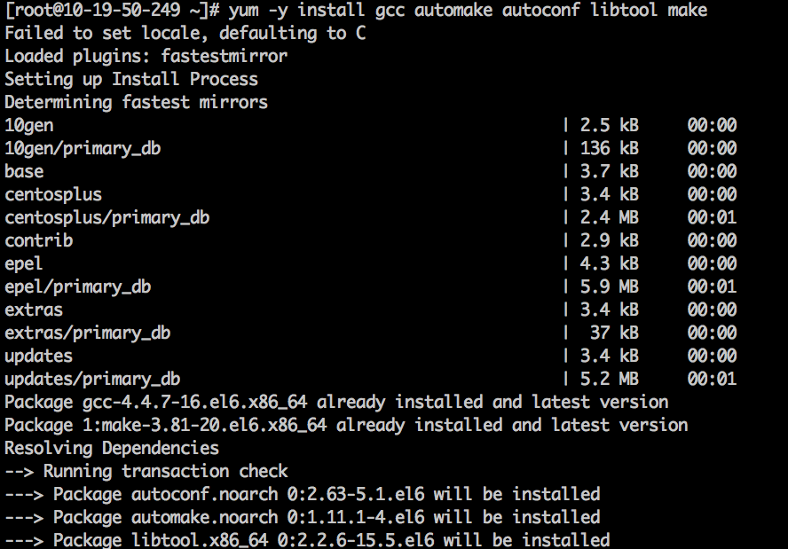
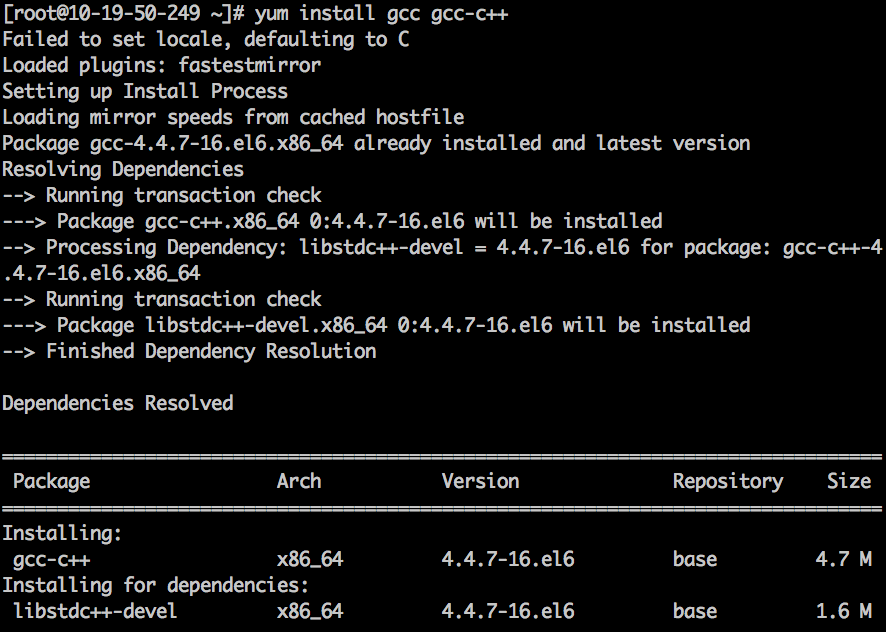
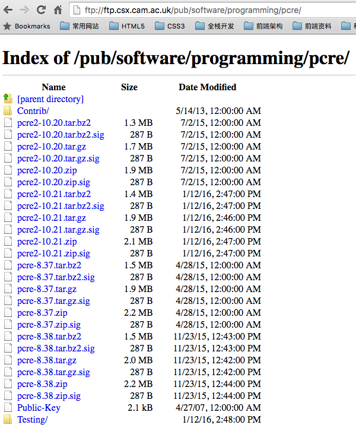
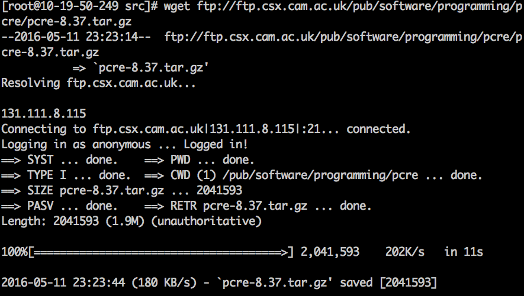

####centos平台编译环境使用如下指令

1. 安装make：

```
yum -y install gcc automake autoconf libtool make
```
效果如下:




2. 安装g++:
```
yum install gcc gcc-c++
```
效果如下:



3. 正式开始

    一般我们都需要先装pcre, zlib，前者为了重写rewrite，后者为了gzip压缩。

3.1 选定源码目录

    可以是任何目录，本文选定的是/usr/local/src

```
cd /usr/local/src
```

3.2 安装PCRE库

ftp://ftp.csx.cam.ac.uk/pub/software/programming/pcre/ 下载最新的 PCRE 源码包，使用下面命令下载编译和安装 PCRE 包：

```
cd /usr/local/src
wget ftp://ftp.csx.cam.ac.uk/pub/software/programming/pcre/pcre2-10.20.tar.gz
tar -zxvf pcre2-10.20.tar.gz
cd pcre2-10.20
./configure
make
make install
```

最新的pcre如下:


wget安装pcre



3.3 安装zlib库

http://zlib.net/zlib-1.2.8.tar.gz 下载最新的 zlib 源码包，使用下面命令下载编译和安装 zlib包：

```
cd /usr/local/src
wget http://zlib.net/zlib-1.2.8.tar.gz
tar -zxvf zlib-1.2.8.tar.gz
cd zlib-1.2.8
./configure
make
make install
```
3.4 安装ssl（某些vps默认没装ssl)

```
cd /usr/local/src
wget http://www.openssl.org/source/openssl-1.1.0-pre5.tar.gz
tar -zxvf openssl-1.1.0-pre5.tar.gz
```
3.5 安装nginx

Nginx 一般有两个版本，分别是稳定版和开发版，您可以根据您的目的来选择这两个版本的其中一个，下面是把 Nginx 安装到 /usr/local/nginx 目录下的详细步骤：

```
cd /usr/local/src
wget http://nginx.org/download/nginx-1.9.9.tar.gz
tar -zxvf nginx-1.9.9.tar.gz
cd nginx-1.9.9

./configure --sbin-path=/usr/local/nginx/nginx
--conf-path=/usr/local/nginx/nginx.conf
--pid-path=/usr/local/nginx/nginx.pid
--with-http_ssl_module
--with-pcre=/usr/local/src/pcre-8.34
--with-zlib=/usr/local/src/zlib-1.2.8
--with-openssl=/usr/local/src/openssl-1.0.1c

make
make install
```

--with-pcre=/usr/src/pcre-8.34 指的是pcre-8.34 的源码路径。
--with-zlib=/usr/src/zlib-1.2.7 指的是zlib-1.2.7 的源码路径。

安装成功后 /usr/local/nginx 目录下如下
```
CHANGES     LICENSE   README  conf       contrib  man   src
CHANGES.ru  Makefile  auto    configure  html     objs
```

```
fastcgi.conf            koi-win             nginx.conf.default
fastcgi.conf.default    logs                scgi_params
fastcgi_params          mime.types          scgi_params.default
fastcgi_params.default  mime.types.default  uwsgi_params
html                    nginx               uwsgi_params.default
koi-utf                 nginx.conf          win-utf
```
3.6 启动

确保系统的 80 端口没被其他程序占用，运行/usr/local/nginx/nginx 命令来启动 Nginx，

netstat -ano|grep 80

如果查不到结果后执行，有结果则忽略此步骤（ubuntu下必须用sudo启动，不然只能在前台运行）


sudo /usr/local/nginx/nginx

打开浏览器访问此机器的 IP，如果浏览器出现 Welcome to nginx! 则表示 Nginx 已经安装并运行成功。

