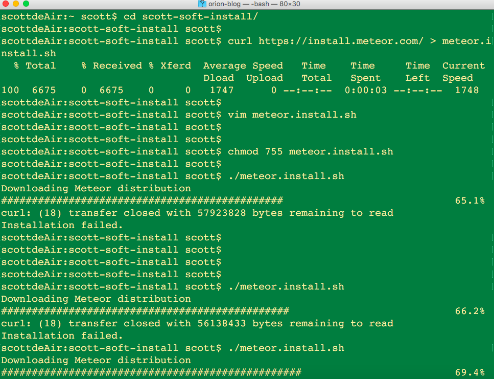

由于国内网络环境的原因,安装meteor时总是频繁失败.

meteor默认的安装方法是这样的
```
curl https://install.meteor.com/ | sh
```

这条命令做了两件事，

    1.从网站 https://install.meteor.com/ 下载了一个shell脚本，

    2.运行了这个脚本。在这个脚本里会根据操作系统的不同具体下载meteor的安装包。

我们安装失败的主要原因是因为meteor的安装包非常大，大概180M左右，而这个脚本里下载meteor安装包时，没有考虑断点续传的问题（真是白天不懂夜的黑啊，在美帝可能真的想不到有天朝这样的网络）。

所有我们就动手改造一个符合天朝网络情况的安装脚本。

先建个目录。
```
mkdir meteor-install
```

下载官方的安装脚本。
```
curl https://install.meteor.com/ > meteor.install.sh
```

改造安装脚本
```
vim meteor.install.sh
```

修改大概140行左右的这句命令
```
curl --progress-bar --fail "$TARBALL_URL" | tar -xzf - -C "$INSTALL_TMPDIR" -o
```
改成这样，变成了两行
```
curl -C - --progress-bar "$TARBALL_URL" -O

tar -xzf meteor-bootstrap-${PLATFORM}.tar.gz -C "$INSTALL_TMPDIR" -o
```
设置一下脚本执行权限
```
chmod 755 meteor.install.sh
```
打完收工，运行一下脚本
```
./meteor.install.sh
```
在安装过程如果断了再次执行
```
./meteor.install.sh
```
下载的进度就会从之前的地方开始了。


